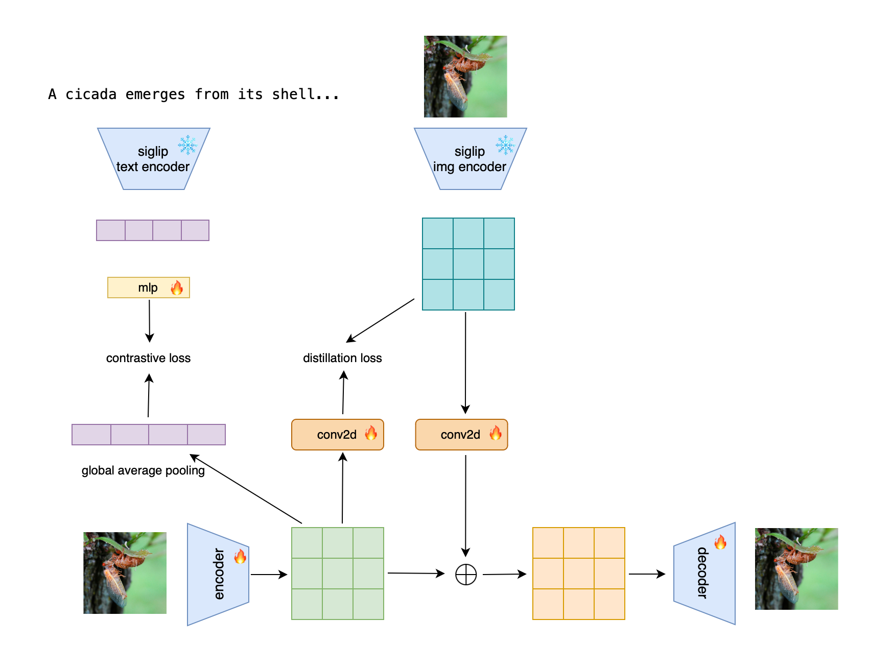

</div>
<div align="center">

</div>

## 📄 Introduction

The core reason we hope to use a single model for both generation and understanding is that we believe these two tasks can promote each other. However, existing work has not sufficiently explored this area. In many experiments, performance metrics have declined. We speculate that understanding requires high-level features, while generation requires low-level features. Training them together may cause conflicts. Most solutions involve using separate features for understanding and generation. But using different features for these two tasks is not conducive to their mutual promotion.
Siglip-VAE integrates high-level Siglip features with the reconstruction capabilities of VAE to create a fused feature that contains both semantics and pixel information. Subsequent generation and understanding tasks can utilize this fused feature, which is beneficial for mutual promotion.

## 🧪 Experimental Results
| Tokenizer | Generation Model | FID cfg |
|:---------:|:----------------|:----:|:---:|
| SIGLIP-VAE| LightningDiT-XL-800ep | 1.6 |


## 🎯 How to Use

### Installation

```
conda create -n lightningdit python=3.10.12
conda activate lightningdit
pip install -r requirements.txt
```

### Inference with Pre-trained Models

- Download weights and data infos:
SIGLIP-VAE：
LightningDiT-XL：

- Fast sample demo images:

    Run:
    ```
    bash bash run_fast_inference.sh ${config_path}
    ```
    Images will be saved into ``demo_images/demo_samples.png``

- Sample for FID-50k evaluation:
    
    Run:
    ```
    bash run_inference.sh ${config_path}
    ```
    NOTE: The FID result reported by the script serves as a reference value. The final FID-50k reported in paper is evaluated with ADM:

    ```
    git clone https://github.com/openai/guided-diffusion.git
    
    # save your npz file with tools/save_npz.py
    bash run_fid_eval.sh /path/to/your.npz
    ```
## 🎮 Train Your Own Models

 
- **We provide a 👆[detailed tutorial](docs/tutorial.md) for training your own models


## ❤️ Acknowledgements

This repo is mainly built on [VA-VAE](https://github.com/hustvl/LightningDiT), [DiT](https://github.com/facebookresearch/DiT), [FastDiT](https://github.com/chuanyangjin/fast-DiT) and [SiT](https://github.com/willisma/SiT). Our VAVAE codes are mainly built with [LDM](https://github.com/CompVis/latent-diffusion) and [MAR](https://github.com/LTH14/mar). Thanks for all these great works.
